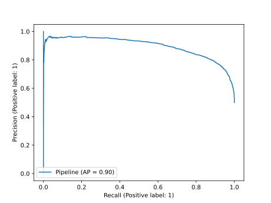

# Collection and Classification of monitored/unmonitored websites using a Random Forest Classifier

This directory contains the code use to implement and evaluate a classifier whose job is to distinguish between
monitored and unmonitored websites having the TLS length of packets in a trace. The experiment can be initiated by
running the [main](main.py) script contained in this folder.

Results display a good ability of the classifier to distinguish between classes:
