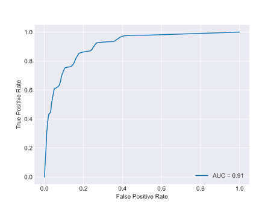
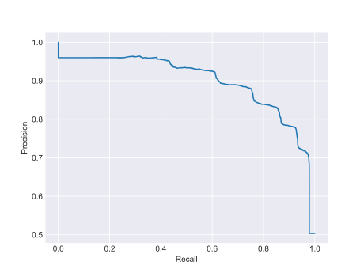

# Classification

This directory contains the code used to implement and evaluate a classifier whose job is to distinguish between
monitored and unmonitored websites. The classifier uses as a feature the TLS length of packets in a trace. The
experiment can be initiated by running the [main](main.py) script contained in this folder. It will first search for the
best parameter of a Random Forest Classifier, and then evaluate the results. Later will train a K Nearest Neighbour
Classifier and searches for the best hyperparameters. 
After the completion of the script, the resulting reports can be found in the [results folder](results) along with
the [plots](results/plot).  
The experiment was executed 2 times: one with the uni-grams as features and one with the bi-grams as features.

- The dataset can be found [here](../../datasets).
- The list of monitored websites used can be found [here](../collection/short_list_1500).
- An already trained model can be found [here](results/model)

## Results

Results display a good ability of the classifier to distinguish between classes. More details in
the [report].

------
ROC Curve and Precision-Recall Curve for the Random Forest Classifier using n=1 for the n-grams

-------
ROC Curve and Precision-Recall Curve for the Random Forest Classifier using n=2 for the n-grams

-------
ROC Curve and Precision-Recall Curve for the K Nearest Neighbor using n=1 for the n-grams

-------
ROC Curve and Precision-Recall Curve for the K Nearest Neighbor using n=2 for the n-grams

